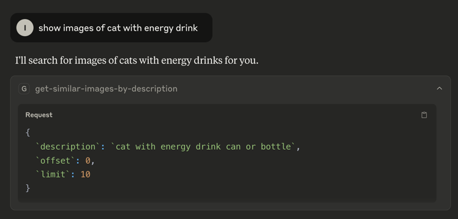
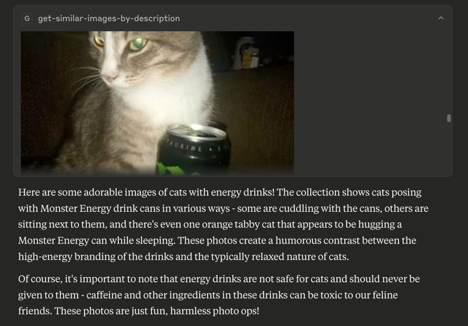

# Inspire MCP Server

A [Model Context Protocol](https://modelcontextprotocol.io) server that uses [Inspire](https://github.com/tech-inspire) backend images search capabilities.

<a href="https://glama.ai/mcp/servers/@tech-inspire/mcp-server">
  
</a>

### Available Tools

- `get-similar-images-by-description` - Get similar images by their text description
    - Required arguments:
        - `description` (string): Image description
        - `limit` (number): Pagination limit
        - `offset` (number): Pagination offset





## Configuration

- `INSPIRE_API_BASE`: base path for the backend gateway. Default: `http://localhost:7080`
- `IMAGES_BASE_PATH`: base path for images. Example: `https://<some-bucket>.s3.com/`

Variables can be configured using environment variables or command-line arguments, depending on the runtime platform (Docker/Node). 

## Building

Docker:

```bash
docker build -t tech-inspire/mcp .
```

Node:

```bash
npm ci && npm run build
```

## Usage with Claude Desktop

Add this to `claude_desktop_config.json`

### Docker

```json
{
  "mcpServers": {
    "inspire": {
      "command": "docker",
      "args": [
        "run",
        "--rm",
        "-i",
        "-e",
        "INSPIRE_API_BASE=<API_URL>",
        "-e",
        "IMAGES_BASE_PATH=<IMAGE_BASE_PATH>",
        "tech-inspire/mcp"
      ]
    }
  }
}
```

### Node

```json
{
  "mcpServers": {
    "inspire": {
      "command": "node",
      "args": [
        "/path/to/repo/build/index.js",
        "--INSPIRE_API_BASE=<INSPIRE_API_BASE>",
        "--IMAGES_BASE_PATH=<IMAGES_BASE_PATH>"
      ]
    }
  }
}
```


## License

This MCP server is licensed under the **GNU General Public License**, as described in the `LICENSE` file.